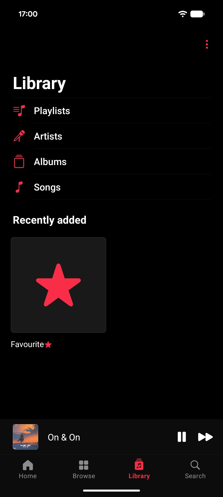
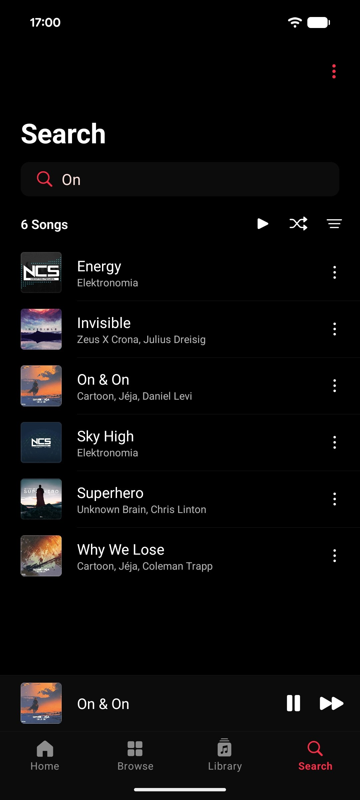
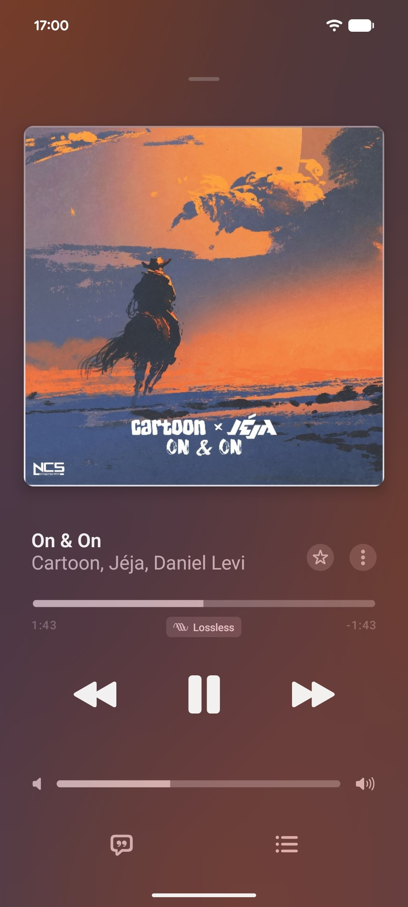

# Accord X

A local music player for Android with an Apple-inspired design. Supports synced lyrics (LRC/SRT), gapless playback, audio crossfade, home screen widget, and third-party equalizers.

Fork of [Accord](https://github.com/PhantomFoundation/Accord) / [Gramophone](https://github.com/PhantomTan/Gramophone) with bug fixes, updated dependencies, and new features.

## Screenshots

<p>
  
  
  
</p>
<p>
  
  
  
</p>

## What's New in v1.5

- **Queue Management**: Added "Add to Queue" and "Play Next" options to song menus.
- **Details UI**: Replaced "View Credits" with a unified "Details" dialog.
- **Daily Shuffle Reliability**: The homepage recommendations carousel now intelligently populates with random songs from your library, eliminating blank cards.
- **Library Streamlining**: Removed the redundant "Songs" tab from the Library screen and fixed the heading display on the "Favourites" page.
- **Tag Editor Fix**: Resolved an issue on modern Android devices where incorrect file paths caused the tag editor to appear stuck or fail to navigate back.
- **Under The Hood**: Implemented memory leak preventions across fragments and improved exception handling to gracefully handle Android 13+ background service restrictions.
- **About Page**: The "Forked By" button now successfully redirects to the GitHub repository.

## Installation

Download the latest APK from [GitHub Releases](https://github.com/PhantomCodeGhost/Accord-X/releases/latest).

## Building

```bash
git clone https://github.com/PhantomCodeGhost/Accord-X.git
cd Accord-X
./gradlew assembleRelease
```

APK will be in `app/build/outputs/apk/release/`.

## Credits

Based on [Gramophone](https://github.com/PhantomTan/Gramophone) by PhantomTan and [Accord](https://github.com/PhantomFoundation/Accord) by Phantom Foundation.

Developed and maintained by [@PhantomCodeGhost](https://github.com/PhantomCodeGhost)

## License

GPL-3.0 — see [LICENSE](LICENSE) for details.
